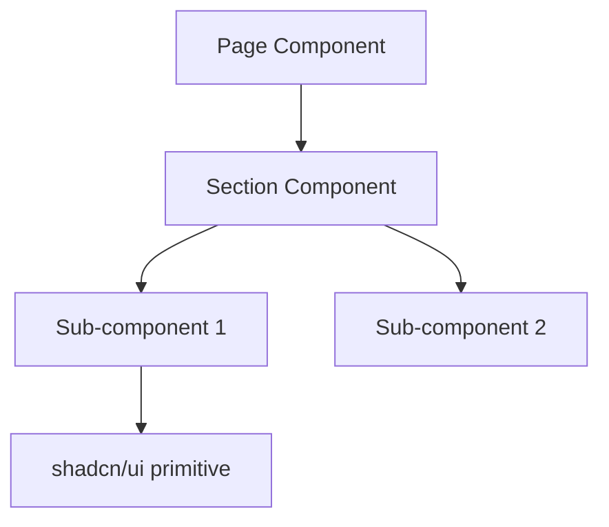

# SDD Writer Iterative Review Skill

## Purpose

This skill provides the complete specification and reusable templates for producing Software Design Documents (SDDs) through a structured, iterative self-review process. It defines the exact SDD structure (15 sections), the two-loop review protocol (20 critiques per loop), decision criteria for accepting or rejecting critiques, and the output format. The SDD Writer Agent activates this skill for every SDD generation task.

## When to Use

**Activate this skill when:**
- A user requests a new feature, system change, or architectural design
- Planning work that affects multiple files, components, or pages
- A feature needs thorough design before implementation begins
- The Main Coordinator needs a blueprint to delegate specialist tasks

**Do NOT use this skill when:**
- The change is a simple bug fix or typo correction
- The task is a single-file edit with no design decisions
- The user explicitly asks for code, not a design document
- The change is purely cosmetic (color tweak, spacing adjustment)

## Prerequisites

Before activating, ensure:

1. **Clear task description** -- the user has described what they want (even if vague, Phase 1 will clarify)
2. **Repository access** -- ability to read files in the repo to ground the design
3. **Success criteria defined** -- either from the user or inferred in Phase 1
4. **Output directory exists** -- `docs/design/` (create if missing)

## SDD Structure Specification

Every SDD MUST contain exactly these 15 sections in this order:

### Section 1: Executive Summary
- **Content**: 2-3 paragraphs for non-technical stakeholders
- **Audience**: Product managers, designers, non-engineers
- **Tone**: No jargon; explain WHAT, WHY, and HIGH-LEVEL HOW
- **Length**: 150-300 words

### Section 2: Problem Statement
- **Content**: Current pain points, user/business impact, cost of inaction
- **Format**: Narrative with quantitative impact where possible
- **Must answer**: "What happens if we don't build this?"

### Section 3: Goals / Non-Goals
- **Goals**: 3-5 items using RFC 2119 language (MUST/SHOULD/MAY)
- **Priority**: P0 (must-have), P1 (should-have), P2 (nice-to-have)
- **Non-Goals**: Frame as "This SDD does NOT cover..."
- **Purpose**: Prevent scope creep; each goal must be testable

### Section 4: Functional Requirements
- **Format**: Structured requirement IDs

```
FR-001: [MUST] <description>
  - Input: <trigger>
  - Output: <expected result>
  - Acceptance: <verification method>

FR-002: [SHOULD] <description>
  - Input: <trigger>
  - Output: <expected result>
  - Acceptance: <verification method>
```

### Section 5: Non-Functional Requirements
- **Categories to cover**:
  - Performance: Lighthouse score targets, load time budgets
  - Accessibility: WCAG 2.1 AA compliance
  - Responsiveness: Breakpoints (375px, 768px, 1024px+)
  - Browser support: Modern evergreen browsers
  - Dark mode: Must work with CSS custom property system
  - SEO: Metadata requirements

### Section 6: Assumptions & Constraints

| Assumptions (believed true) | Constraints (hard limits) |
|----------------------------|--------------------------|
| Next.js 16 App Router is the framework | Must use existing Tailwind v4 + shadcn/ui stack |
| Static site (no backend APIs) | No external runtime dependencies |
| ... | ... |

### Section 7: Proposed Solution
- **Required elements**:
  - Architecture overview with component hierarchy
  - Data flow description
  - TypeScript interface definitions
  - Technology choices with justification
  - File paths for new/modified files
  - **At least one Mermaid diagram**

**Mermaid diagram template**:

````markdown

````

**Repo patterns to reference**:

| Pattern | Location | Convention |
|---------|----------|------------|
| Pages | `src/app/<route>/page.tsx` | App Router file conventions |
| Components | `src/components/<domain>/` | Named exports, PascalCase files |
| UI primitives | `src/components/ui/` | shadcn/ui, do not modify |
| Data models | `src/data/<name>.ts` | TypeScript interfaces + arrays |
| Styling | `src/app/globals.css` | CSS custom properties, OKLCH |
| Utilities | `lib/utils.ts` or `src/lib/` | `cn()` for class composition |
| Layout | `src/components/layout/` | Header, Footer, Nav |

### Section 8: Security / Privacy / Compliance
- XSS prevention (sanitize user-facing content)
- Dependency security (`pnpm audit`)
- External link safety (`rel="noopener noreferrer"`, `target="_blank"`)
- Content Security Policy considerations
- No sensitive data in client bundle

### Section 9: Observability & Operations
- Error boundaries for graceful failure
- `pnpm build` validation (no build errors)
- Lighthouse performance/accessibility scores
- Console error monitoring in development
- `loading.tsx` and `error.tsx` for user feedback

### Section 10: Rollout / Migration Plan
- Feature branch workflow: `feature/<short-name>` from `main`
- PR with description referencing the SDD
- Migration steps if modifying existing pages/components
- Rollback: revert PR if issues found
- No feature flags needed for static site features

### Section 11: Testing Strategy

| Level | Approach | Tools |
|-------|----------|-------|
| Unit | Component rendering, prop validation | Vitest + React Testing Library |
| Integration | Page-level rendering, data flow | Vitest |
| E2E | Critical user journeys | Playwright (if configured) |
| Accessibility | Automated WCAG checks | axe-core, Lighthouse |
| Visual | Responsive breakpoint verification | Manual + browser DevTools |

### Section 12: Risks & Mitigations

| # | Risk | Likelihood | Impact | Mitigation |
|---|------|-----------|--------|------------|
| R1 | Example risk | Low/Med/High | Low/Med/High | Specific mitigation |

- Minimum 3 risks required
- Be realistic, not alarmist
- Include technical AND process risks

### Section 13: Open Questions

```
OQ-001: <question>
  - Context: <why this matters>
  - Proposed resolution: <suggestion>
  - Owner: <who answers -- usually "Raph" or "TBD">
```

**HARD RULE**: Never invent facts. If uncertain, add an Open Question.

### Section 14: Appendix
- Alternative approaches considered (with rejection reasons)
- Reference links (documentation, examples, inspiration)
- Additional Mermaid diagrams if needed
- Research notes

### Section 15: Iteration History
- Empty in SDD v1
- After Loop 1: Full critique log, decision table, list of modified sections
- After Loop 2: Full critique log, decision table, list of modified sections

## Iterative Review Process

### Overview

Two self-review loops transform SDD v1 into SDD v3 (final):

```
SDD v1 (draft) --> Loop 1 (20 critiques) --> SDD v2 --> Loop 2 (20 critiques) --> SDD v3 (final)
```

### Critique Point Template

Each critique must include all four fields:

```
Critique #<N>:
  Section: <number>. <section name>
  Issue: <specific problem or gap identified>
  Risk/Impact: <what could go wrong if not addressed>
  Suggestion: <concrete, actionable improvement>
```

### Accept/Reject Decision Criteria

**ACCEPT if the critique:**

| Criterion | Example |
|-----------|---------|
| Improves clarity | "Section 4 requirement FR-003 is ambiguous about edge cases" |
| Addresses a real gap | "No accessibility requirements for keyboard navigation" |
| Aligns with repo patterns | "Should reference existing cn() utility pattern" |
| Makes requirements testable | "Add specific Lighthouse score targets" |
| Reduces risk | "Missing rollback procedure for database migration" |
| Improves security | "External links missing rel=noopener" |

**REJECT if the critique:**

| Criterion | Example |
|-----------|---------|
| Out of scope | "Should also design the blog feature" |
| Lacks evidence | "Might need WebSocket support" (no indication needed) |
| Conflicts with requirements | "Use Vue instead of React" |
| Premature optimization | "Add Redis caching layer" |
| Stylistic preference | "Rename Section 7 to Technical Design" |
| Already addressed | "Need a Mermaid diagram" (already present) |

### Decision Table Format

Each loop produces a 20-row decision table:

| # | Section | Issue Summary | Decision | Reason |
|---|---------|--------------|----------|--------|
| 1 | 4. Functional Requirements | FR-003 missing edge case | ACCEPT | Improves testability |
| 2 | 7. Proposed Solution | Should add Redis cache | REJECT | Premature optimization for static site |
| ... | ... | ... | ... | ... |
| 20 | ... | ... | ... | ... |

### Loop Documentation Template

After each loop, append to Section 15:

```markdown
### Loop <N> (SDD v<N> -> v<N+1>)

**Date**: <YYYY-MM-DD>
**Reviewer persona**: Principal Engineer

#### Critiques

<all 20 critique points>

#### Decision Table

<20-row table>

#### Summary
- Accepted: <N>/20
- Rejected: <N>/20
- Sections modified: <list>

#### Accepted Changes Applied
<brief description of each change made>
```

## Process Flow

```
Phase 1: Infer Intent
    |
    v
Phase 2: Read Repo Context
    |
    v
Phase 3: Write SDD v1 (15 sections)
    |
    v
Phase 4: Loop 1 -- 20 critiques --> accept/reject --> SDD v2
    |
    v
Phase 5: Loop 2 -- 20 NEW critiques --> accept/reject --> SDD v3
    |
    v
Phase 6: Save to docs/design/ + Generate Summary
```

## Grounding in Repository Context

### What to Look For

| Context | Where to Find It | Why It Matters |
|---------|------------------|---------------|
| Project structure | File tree, `src/app/`, `src/components/` | Understand routing and component org |
| Tech stack | `package.json`, `tsconfig.json` | Know available tools and versions |
| Styling conventions | `globals.css`, `tailwind.config.ts` | Match existing design tokens |
| Data patterns | `src/data/` | Reuse existing data model patterns |
| Component patterns | `src/components/ui/`, `src/components/layout/` | Follow established conventions |
| Prior designs | `docs/design/`, `docs/sdd/` | Learn from previous decisions |
| Agent system | `.github/agents/`, `.github/skills/` | Understand delegation model |
| Project context | `memory-bank/`, `README.md` | Understand goals and status |

### Grounding Rules
- ALWAYS read existing files before proposing new patterns
- PREFER reusing existing patterns over inventing new ones
- DOCUMENT why a new pattern is needed when deviating
- REFERENCE specific file paths in the Proposed Solution section

## File Output Convention

**Path**: `docs/design/<YYYY-MM-DD>-<short-title>.md`

| Element | Format | Example |
|---------|--------|---------|
| Date | ISO 8601 | `2026-02-28` |
| Title | kebab-case, 2-4 words | `hero-section` |
| Full path | `docs/design/` prefix | `docs/design/2026-02-28-hero-section.md` |

If `docs/design/` does not exist, create it before saving.

## Completion Summary Template

```markdown
## SDD Generation Summary

| Metric | Value |
|--------|-------|
| Loops completed | 2 |
| Loop 1: Critiques generated | 20 |
| Loop 1: Accepted | <N> |
| Loop 1: Rejected | <N> |
| Loop 2: Critiques generated | 20 |
| Loop 2: Accepted | <N> |
| Loop 2: Rejected | <N> |
| Total critiques | 40 |
| Total accepted | <N> |
| Total rejected | <N> |
| Acceptance rate | <N>% |

### Rejection Themes
| Category | Count | Examples |
|----------|-------|---------|
| Out of scope | <N> | ... |
| Premature optimization | <N> | ... |
| Stylistic preference | <N> | ... |
| Lacks evidence | <N> | ... |
| Already addressed | <N> | ... |

### Output
- **File**: docs/design/<filename>.md
- **Sections**: 15
- **Diagrams**: <N>
- **Open Questions**: <N>
- **Functional Requirements**: <N>
- **Risks Identified**: <N>
```

## Hard Rules

1. Exactly 2 review loops, no more, no less
2. Exactly 20 critique points per loop (40 total)
3. Apply ONLY accepted items; rejected items MUST NOT modify the SDD
4. Document both loops with full iteration history in Section 15
5. No hallucinations; unknowns go in Open Questions (Section 13)
6. At least one Mermaid diagram required in Section 7
7. Save to `docs/design/<YYYY-MM-DD>-<short-title>.md`
8. Generate the completion summary with statistics
9. All 15 sections required; no skipping, combining, or reordering
10. Ground in repo context; check existing patterns before proposing new ones

## Success Criteria

- [ ] All 6 phases completed in order
- [ ] Repository context read (not assumed) in Phase 2
- [ ] All 15 SDD sections present with meaningful content
- [ ] At least one Mermaid diagram in Section 7
- [ ] Loop 1: exactly 20 critiques with full decision table
- [ ] Loop 2: exactly 20 NEW critiques with full decision table
- [ ] Only accepted changes applied to the SDD
- [ ] Full iteration history in Section 15
- [ ] Final SDD saved to correct path
- [ ] Completion summary with statistics and rejection themes

## Anti-Patterns

### DON'T

- Skip or combine review loops
- Generate more or fewer than 20 critiques per loop
- Apply rejected changes to the SDD
- Invent information when uncertain
- Accept or reject all critiques (aim for thoughtful mix)
- Write empty or placeholder sections
- Skip the Mermaid diagram
- Forget to save the file
- Forget to generate the summary
- Reuse Loop 1 critiques in Loop 2

### DO

- Follow all 6 phases in order
- Ground designs in actual repo file reads
- Document uncertainties in Open Questions
- Make thoughtful accept/reject decisions with reasoning
- Include testable acceptance criteria
- Reference real file paths and patterns
- Create the output directory if needed
- Produce the full completion summary

## Related Skills

| Skill | Relationship |
|-------|-------------|
| `project-context` | Provides repo structure knowledge for Phase 2 grounding |
| `code-standards` | Informs coding conventions referenced in proposed solutions |
| `git-workflow` | Defines the branch and PR strategy for rollout plans |
| `nextjs-app-router` | Reference for routing patterns in proposed solutions |
| `tailwind-v4` | Reference for styling patterns in proposed solutions |
| `shadcn-ui` | Reference for component library usage in proposed solutions |
| `accessibility` | Informs non-functional requirements and testing strategy |
| `seo-metadata` | Informs metadata requirements in proposed solutions |
| `design-system` | Provides design token and spacing references |
| `code-review-checklist` | QA Reviewer uses this to validate the implemented SDD |
